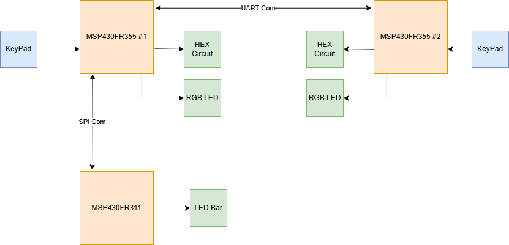
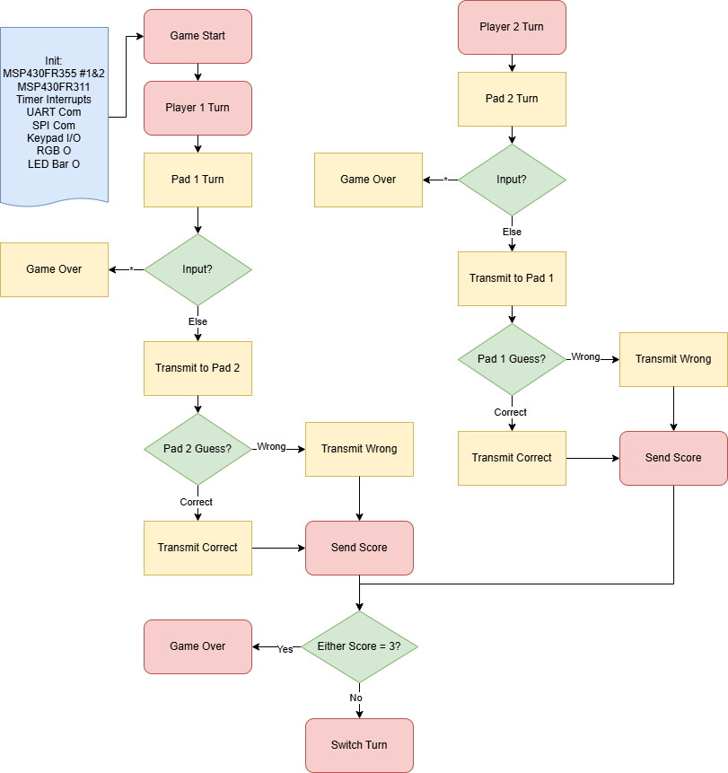

# Final project proposal

- [Aids] I have reviewed the project guidelines.
- [Aids] I will be working alone on this project.
- [Aids] No significant portion of this project will be (or has been) used in other course work.

## Embedded System Description

**Total System**
This Embeded system will integrate two MSP430FR355 microcontrollers with each other communicating inputs each has to the other with UART. The Master will also communicate with a MSP430FR311 through SPI to update an LED bar. The purpose of the system is to play a matching game between two keypad inputs and keep track of the score on the LED bar.

**MSP430FR355 #1**

Output 1. UART connection to MSP430FR355 #2 to transmit data. This will transmit a collection of different pieces of data depending on the state of the game.

Input 1. UART connection to MSP430FR355 #2 to recieve data. This will recieve a collection of different pieces of data depending on the state of the game.

Output 2. SPI connection to MSP430FR311 to transmit data. This will be transmitting the score of the game to be displayed on the LED Bar.

Input2. SPI connection to MSP430FR311 to recieve acknowledges to ensure the communication is working correctly.

Output 3. HEX Display Circuit. This circuit will consist of a 4bit-7segment display decoder and will be driven by the MSP.

Input 3. Keypad. The Keypad will be used to gather data from a human input which is what powers the game.

Output 4. RGB LED. The RGB LED will be used to display the status of the game and the system.

**MSP430FR350 #2**

Output 1. UART connection to MSP430FR355 #1 to transmit data. This will transmit a collection of different pieces of data depending on the state of the game.

Input 1. UART connection to MSP430FR355 #1 to recieve data. This will recieve a collection of different pieces of data depending on the state of the game.

Output 2. HEX Display Circuit. This circuit will consist of a 4bit-7segment display decoder and will be driven by the MSP.

Input 2. Keypad. The Keypad will be used to gather data from a human input which is what powers the game.

Output 3. RGB LED. The RGB LED will be used to display the status of the game and the system.

**MSP430FR311**

Output 1. SPI connection to MSP430FR355 #1 to transmit data. This will transmit acknowledges to ensure proper communication with the MSP.

Input 1. SPI connection to MSP430FR355 #1 to recieve data. This will recieve a byte of data related to the "score" of the game to be displayed.

Output 2. LED Bar. This will be to display the score of the game for the users to see while playing.

## Hardware Setup

The UART and SPI connections are bi-directional and every other connection is uni-directional. The Hex Display Circuit is composed of both a HEX display and a 4bit-7segment decoder. 

## Software overview

Discuss, at a high level, a concept of how your code will work. Include a *high-level* flowchart. This is a high-level concept that should concisely communicate the project's concept.

## Testing Procedure

Briefly describe how you will test and verify that your project is a success. Think about how you will *demo* the final project. If you need extra equipment for the demo, be sure that you can either bring the equipment or convincingly simulate it. For example, if you want to build a system that uses CAN bus to interface with your car, you won't be able to bring your car into Cobleigh for the demo...

## Prescaler

Desired Prescaler level: 

- [ ] 100%
- [ ] 95% 
- [ ] 90% 
- [ ] 85% 
- [ ] 80% 
- [ ] 75% 

### Prescalar requirements 

**Outline how you meet the requirements for your desired prescalar level**

**The inputs to the system will be:**
1.  Short description of input #1
2.  

**The outputs of the system will be:**
1.   Short description of output #1
2. 

**The project objective is**

{text – 1 to 2 sentences}

**The new hardware or software modules are:**
1. Short description of new hardware or software module
2. 

The Master will be responsible for:

{text – 1 to 2 sentences}

The Slave(s) will be responsible for:

{text – 1 to 2 sentences}

### Argument for Desired Prescaler

Consider the guidelines presented in the lecture notes and convince the reviewers that this proposal meets the minimum requirements for your desired prescale level.
